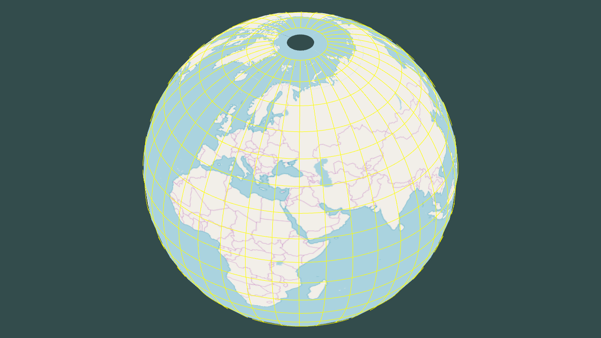
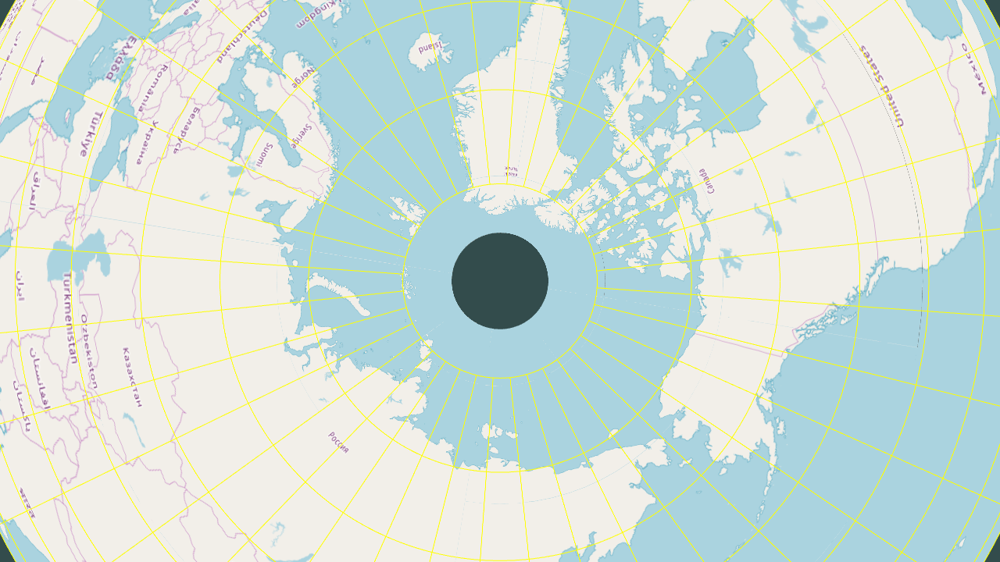
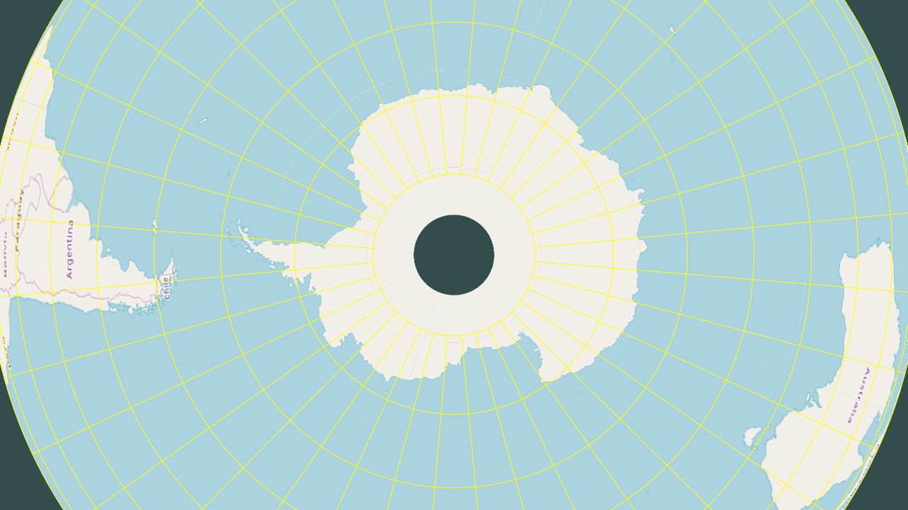
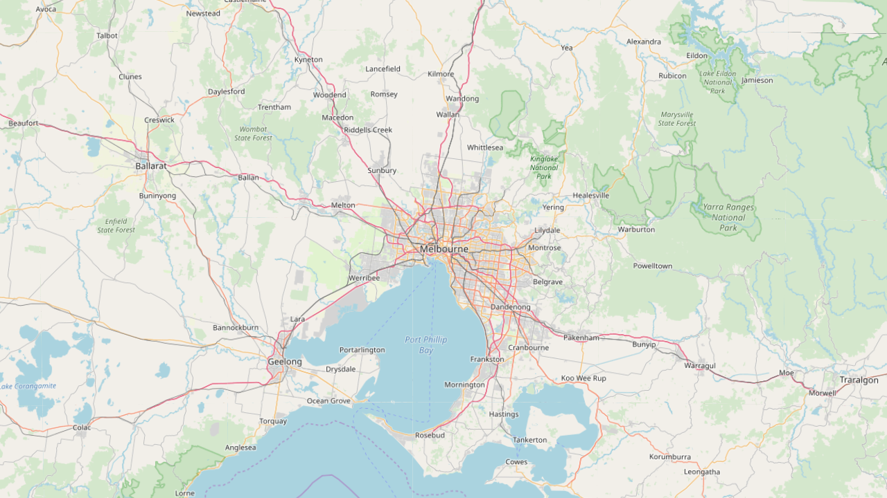
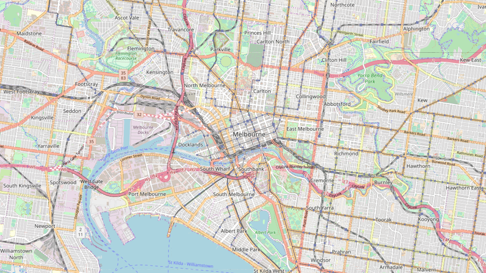
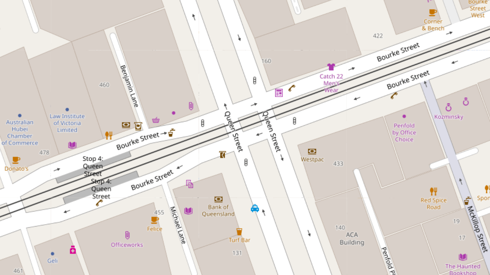

## What is GlobeViewer?

[GlobeViewer](https://github.com/green-anger/GlobeViewer) allows you to view popular online maps not in Mercator but Orthographic projection.
[Greenland will never be larger than Australia](https://www.quora.com/Which-is-bigger-Australia-or-Greenland) again.
In addition to viewing tiles GlobeViewer caches them. So viewed once the tiles will be available to you afterwards even offline!
Currently it supports [OpenStreetMap](https://www.openstreetmap.org) and [2GIS](https://2gis.com) tiles.

Keep in mind that the tiles are not changed, so switching to another projection (from Mercator to Orthographic) will distort them a bit.
But all symbols remain readable at all zoom levels.

## How to use it

GlobeViewer is designed to be used as a library in any application than can create OpenGL context. Currently it has only been tested with [GLFW](https://www.glfw.org/).
You can find corresponding example [next door](./examples/glfw).

If you have build [the library](./lib) (and all its dependencies in case of static build), you can easily use it in your project by adding single header [GlobeViewer.h](/lib/include/GlobeViewer.h).
And that's it. Just call API methods from your application.

## Provided example controls

[GLFW example](./examples/glfw) has the following controls:
* Hold left mouse button and drag to move the Globe
* Hold left mouse button, hold Shift key and drag to rotate the Globe
* Scroll mouse wheel up to zoom in
* Scroll mouse wheel down to zoom out
* Press key 'C' to place the Globe in window center
* Press key 'B' to rotate the Globe so that projection center is at [0, 0]
* Press key 'P' to rotate the Globe so that projection center is at the current mouse cursor position if it's inside the Globe, ignore otherwise
* Press key 'T' to toggle between two tile servers
* Press key '1' to toggle display of wire-frame
* Press key '2' to toggle display of map tiles
* Press Escape to exit

## Screenshots

## Documentation

Library is fully documented with [Doxygen](http://www.doxygen.org/). Docs can be easily generated from provided [Doxyfile](./doc/Doxyfile):
if you have Doxygen installed go to [doc directory](./doc) and call 'doxygen' without parameters. If you don't have [Graphviz](https://graphviz.org/)
installed in [Doxyfile](./doc/Doxyfile) make sure HAVE_DOT is set to NO:
`HAVE_DOT               = NO`
Or just comment it out as 'NO' is a default value:
`#HAVE_DOT               = YES`

## Dependencies

General:
* C++14

Embedded into the source code:
* [Glad OpenGL loader](https://github.com/Dav1dde/glad) files generated on [this site](https://glad.dav1d.de/)
* [stb_image.h](https://github.com/nothings/stb/blob/master/stb_image.h) from [stb repo](https://github.com/nothings/stb/)
* [ThreadSafePrinter](https://github.com/green-anger/ThreadSafePrinter/)
* [Profiler](https://github.com/green-anger/Profiler/)

Library
* [OpenGL](https://www.khronos.org/opengl/)
* [Boost](https://www.boost.org/) 1.67.0
    - [Boost.Asio](https://www.boost.org/doc/libs/release/libs/asio/)
    - [Boost.Beast](https://www.boost.org/doc/libs/1_68_0/libs/beast/)
    - [Boost.Filesystem](https://www.boost.org/doc/libs/release/libs/filesystem/)
    - [Boost.Optional](https://www.boost.org/doc/libs/release/libs/optional/)
    - [Boost.Signals2](https://www.boost.org/doc/libs/release/libs/signals2/)
    - [Boost.System](https://www.boost.org/doc/libs/release/libs/system/)
* [GLM](https://glm.g-truc.net/)
* [PROJ.4](https://github.com/OSGeo/proj.4/) 5.0.1

GLFW example:
* [GLFW](https://www.glfw.org/)

## Versioning

GlobeViewer uses [Semantic Versioning 2.0.0](https://semver.org/).

## License

GlobeViewer is licensed under [MIT License](./LICENSE).
